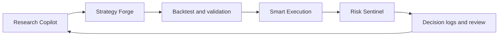

# core workflow

Sidera is organized around a closed-loop trading workflow:

The goal is to preserve context from the first research question to the final trade review. A thesis should not disappear when you move from research to code, and a live order should not be separated from the risk rules that justified it.

## Workflow stages



### Research

Research Copilot helps identify and evaluate market opportunities. It can compare assets, explain catalysts, inspect risk factors, and translate raw market information into a trade thesis.

Output should include:

* Market context.
* Bull case and bear case.
* Trigger conditions.
* Invalidation levels.
* Key risks.
* Time horizon.
* Confidence level and evidence quality.



### Strategy design

Strategy Forge turns the thesis into operational rules. A good strategy definition should include:

* Entry conditions.
* Exit conditions.
* Stop-loss logic.
* Position sizing.
* Market regime assumptions.
* Assets and timeframes.
* Rules for when not to trade.



### Backtesting and validation

Backtesting checks whether the strategy behaves reasonably on historical data. It does not prove future profitability, but it can reveal whether the idea is fragile, overfit, too costly, or too dependent on one market condition.

Review:

* Win rate.
* Profit factor.
* Maximum drawdown.
* Average trade.
* Number of trades.
* Exposure time.
* Fee and slippage assumptions.
* Performance by regime.



### Execution

Smart Execution prepares the order and checks market conditions before placing it. It should confirm:

* RiskGuard approval.
* Current liquidity.
* Slippage estimate.
* Venue availability.
* Order type.
* Position size.
* Strategy permissions.



### Monitoring

Risk Sentinel watches the position after execution. Monitoring should cover:

* Price movement.
* Stop and target status.
* Drawdown.
* Volatility changes.
* Funding or open-interest changes.
* News and event risk.
* Exchange connectivity.



### Review

The review stage closes the loop. Use Sidera's logs to compare:

* What the strategy expected.
* What actually happened.
* Whether the entry was valid.
* Whether risk rules worked.
* Whether execution quality was acceptable.
* What should change before the next trade.



## Example end-to-end workflow

Use case: Build and deploy a SOL momentum strategy.



Ask Research Copilot: "What is the bull case for SOL this week? Include catalysts, liquidity, derivatives positioning, and invalidation levels."



Convert the thesis: "Build a 4-hour momentum strategy for SOL with 2% maximum risk per trade and a trend filter."



Run a backtest across multiple market regimes.



Inspect drawdown, trade count, and behavior during sideways periods.



Set maximum strategy allocation and stop-loss requirements.



Deploy in dry-run mode.



Move to live trading only after the dry-run behavior matches expectations.



Let Risk Sentinel monitor the strategy and alert on abnormal conditions.



Review logs after each trade cycle.



For a more detailed product demo, read [End-to-end demo: prompt to trade](file:///4774416/core-workflow/end-to-end-demo.md).
