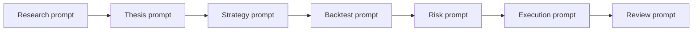

# Prompt examples

This section provides ready-to-use Sidera prompts for research, strategy generation, risk management, execution checks, and post-trade review.

Prompts work best when they define:

- The market or asset.
- The timeframe.
- The decision you are trying to make.
- The required evidence.
- The risk limits.
- The output format.

## Prompt structure

Use this structure for most Sidera prompts:

```text
Objective:
Market:
Timeframe:
Context:
Constraints:
Output format:
Decision needed:
```

Example:

```text
Objective: Decide whether BTC is suitable for a long setup.
Market: BTC perpetuals.
Timeframe: Next 24-72 hours.
Context: I only want trades with clear invalidation and acceptable liquidity.
Constraints: Max 1% account risk per trade. Avoid high funding spikes.
Output format: Bull case, bear case, trigger, invalidation, risk/reward, and next action.
Decision needed: Watch, reject, backtest, or prepare an order.
```

## How to use these prompts

1. Start with research prompts to identify a thesis.
2. Convert the thesis into a strategy prompt.
3. Run backtest and validation prompts.
4. Use risk prompts before allocation.
5. Use execution prompts before live orders.
6. Use review prompts after the trade or strategy cycle.


Prompts are not trading advice. Treat them as workflow templates. Always verify data, risk assumptions, venue behavior, and execution details before trading.


## Recommended prompt flow



For a complete walkthrough of this sequence, see [End-to-end demo](../core-workflow/end-to-end-demo.md).

## Prompt quality checklist

Before running a prompt, check:

- Is the asset clearly named?
- Is the timeframe clear?
- Is the requested output specific?
- Does the prompt ask for invalidation?
- Does it ask for risks, not only upside?
- Does it include position sizing or risk budget when relevant?
- Does it require a decision at the end?
