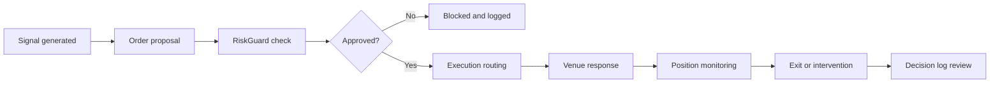

# Order lifecycle

The order lifecycle explains what happens from strategy signal to final review. Understanding this flow helps users diagnose execution issues and evaluate whether Sidera behaved correctly.

## Lifecycle stages

## Signal generated

A signal can come from:

- A live strategy.
- A user prompt.
- A scheduled workflow.
- A risk or monitoring rule.

Signals should include the reason for action, market, direction, timeframe, and invalidation condition.

## Order proposal

An order proposal defines:

- Market.
- Side.
- Size.
- Order type.
- Venue.
- Stop or exit plan.
- Strategy ID.
- Expected risk.

## RiskGuard check

RiskGuard checks the proposal against hard limits. If a check fails, the order is blocked and logged.

Common block reasons:

- Position size too large.
- Missing stop.
- Drawdown limit reached.
- Leverage too high.
- Venue disabled.
- Strategy paused.
- Market condition outside allowed regime.

## Execution routing

If approved, Smart Execution prepares the order for the configured venue. Depending on venue support, Sidera may use market, limit, reduce-only, or sliced execution.

## Venue response

The venue may:

- Accept the order.
- Reject the order.
- Partially fill the order.
- Fully fill the order.
- Cancel the order.

Always treat the venue as the final source of truth for actual fills, fees, and position state.

## Monitoring and exit

After execution, Risk Sentinel monitors the position. Exits may occur through:

- Strategy rules.
- Stop-loss.
- Take-profit.
- Manual override.
- Risk Sentinel intervention.
- Venue liquidation or forced close, depending on market conditions.

## Review

Every order should end with a reviewable record. If no log exists, the workflow is not ready for professional use.

