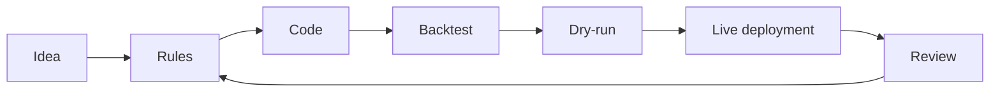

# Strategy Lab

Strategy Lab is the workspace for creating, editing, backtesting, and preparing strategies for deployment.

Use Strategy Lab when you want to move from a trading idea to a structured strategy with testable rules.

## Strategy lifecycle

## Create a strategy

1. Start with a plain-language idea.
2. Define market, timeframe, entry, exit, and risk assumptions.
3. Ask Strategy Forge to generate the strategy.
4. Inspect the generated rules and code.
5. Save strategy metadata.
6. Run a backtest.
7. Compare results against your acceptance criteria.

## Acceptance criteria

Before a strategy moves forward, define what "good enough" means.

Example criteria:

- At least 100 historical trades, if the strategy frequency allows it.
- Profit factor above your minimum threshold after fees.
- Maximum drawdown within your risk tolerance.
- No catastrophic performance in sideways markets.
- Average loss is controlled and consistent with the stated stop logic.
- Results do not depend on one or two outsized trades.

## Backtest interpretation

Do not judge a strategy by return alone.

| Metric | What to look for |
| --- | --- |
| Profit factor | Whether gross wins meaningfully exceed gross losses. |
| Maximum drawdown | Whether the worst loss period is tolerable. |
| Trade count | Whether the sample size is large enough. |
| Average trade | Whether edge survives fees and slippage. |
| Exposure time | Whether capital is tied up too often. |
| Losing streak | Whether the strategy is psychologically and financially tolerable. |

## Dry-run deployment

Dry-run mode lets you observe behavior without live order placement.

Use dry-run to confirm:

- Entries trigger when expected.
- Stops and exits are generated correctly.
- RiskGuard checks fire correctly.
- Logs are complete.
- Alerts reach the expected channels.

